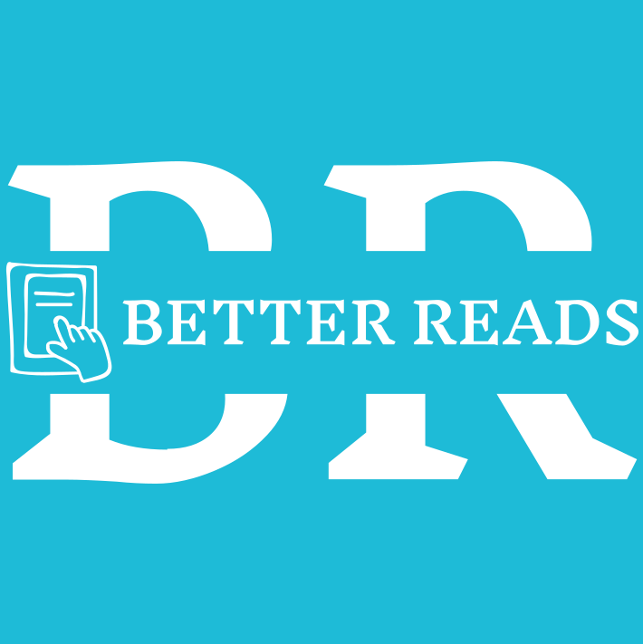

## Books App


## Table of contents
* [How it works](#how-it-works)
* [API's](#apis-used)
* [WireFrame](#wireframe)
* [Preview](#preview)
* [Books](#Books-page)
* [Functions](#functions)
* [Databases](#Database)
* [Future Features](#future-features)
* [Collaborators](#collaborators)

## How it Works


## APIs Used
>

>

## WireFrame
![original-project-outline]

- HTML - this is the markup language for our document to be displayed on the web browser
- CSS - this is the language we use to style an HTML document as well as describes how HTML elements should be displayed.
- JavaScript - this  is a scripting language that enables you to create dynamically updating content, control multimedia, animate images, and pretty much everything else

## Preview
![screenshot]

# Books Page

## Functions

![screenshot]
![screenshot]
![screenshot]
![screenshot]
![screenshot]
![screenshot]

## Latest Development Changes
```
git clone 
```

## Future Features
With this project we would like to expand our scope beyond the books current in the Database and add and populate more books to the Database

These are some of our purposed additions:


# Resources
- [RapidAPI](https://rapidapi.com/collection/list-of-free-apis)
- [W3schools](https://www.w3schools.com)
- [Developer.Mozilla](https://developer.mozilla.org/en-US)
- [Geeksforgeeks](https://www.geeksforgeeks.org/javascript)
- [Trello](https://trello.com/b/RMK5YooL/utabc-project-2)
- [Handlebars](https://handlebarsjs.com)
- [Kaggle](https://www.kaggle.com/datasets)

## License
- [MIT](https://github.com/git/git-scm.com/blob/main/MIT-LICENSE.txt)

# Collaborators
- Harrison Boatman (https://github.com/harrisonboatman)
- Matthew Vasquez (https://github.com/MatthewSince97)
- Camelia Benavides (https://github.com/cameliabenavides10)
- Holden Claus (https://github.com/HoldyClaus)